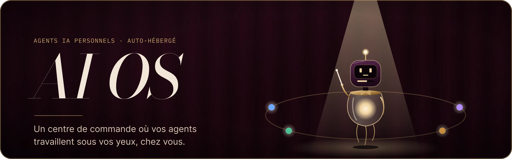
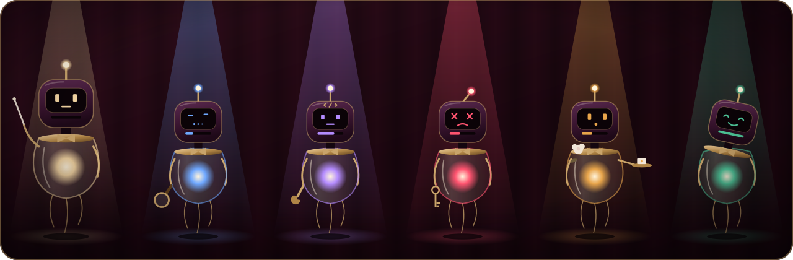

<p align="center">
  
</p>

<p align="center"><em>Une nova est une étoile qui s'illumine soudain.</em></p>

AI OS est un centre de commande personnel pour agents IA. Chaque agent y est un petit robot animé, et chaque mouvement correspond à ce que l'agent fait vraiment. L'application tourne chez vous, sur votre PC ou un Raspberry Pi, et vos données y restent.

## En bref

- **Local.** AI OS s'auto-héberge. Aucun service cloud, hormis l'API du modèle de langage.
- **Visible.** Vos agents apparaissent sur une carte. Leur état se lit d'un coup d'œil, sans journal à éplucher.
- **Sous contrôle.** Aucun agent n'est créé, activé ni lancé sans une action explicite de votre part.
- **Sobre.** Aucune animation décorative : un robot qui bouge est un agent qui travaille.

## Pourquoi « NOVA »

Au centre de la carte se tient NOVA, l'orchestrateur. Une nova est une étoile qui s'illumine soudainement : quand vous donnez une commande, NOVA s'allume et désigne l'agent qui convient, comme une étoile au centre d'un système autour duquel les agents gravitent. En latin, *nova* veut aussi dire « nouvelle » : une nouvelle façon de travailler avec ses agents.

NOVA ne fait pas le travail elle-même. Elle lit votre demande, choisit un seul agent, préremplit son formulaire et vous laisse lancer l'exécution.

## Aperçu

Chaque agent est une Lanterne à tête-écran : une tête laquée avec antenne, un corps en cloche de verre et un nœud papillon. Sa pose, sa lumière et son rythme traduisent l'un de ces six états.

<p align="center">
  
</p>

| De gauche à droite | État affiché |
|---|---|
| NOVA, l'orchestrateur | Au repos |
| Research | En réflexion |
| Coding | Au travail |
| Home | En erreur |
| Personal | En attente d'approbation |
| Agent générique | Terminé |

Les six états :

| État | Ce qu'il signifie |
|---|---|
| Au repos (`IDLE`) | L'agent est disponible et attend une demande. |
| Au travail (`WORKING`) | L'agent exécute une tâche. |
| En réflexion (`THINKING`) | L'agent attend la réponse du modèle de langage. |
| En attente d'approbation (`WAITING_APPROVAL`) | L'agent attend votre accord pour continuer. |
| En erreur (`ERROR`) | L'exécution a échoué ; le motif est affiché. |
| Terminé (`COMPLETED`) | L'exécution a réussi ; le résultat est disponible. |

Une capture de l'interface sera ajoutée lorsque le centre de commande tournera sur de vraies données.

## Où en est le projet

AI OS est en cours de construction. La version actuelle est une **interface sur données fictives** : elle montre le centre de commande sans encore exécuter d'agent.

**Disponible aujourd'hui**
- Le centre de commande : la carte avec NOVA au centre et les territoires des agents en orbite, les robots et leurs états, l'activité en direct, l'état du système et le champ de commande.
- La navigation vers les pages Agents, Tâches, Journaux, Mémoire, Connaissances et Outils, dont certaines affichent encore « à venir ».

**Pas encore disponible**
- L'exécution réelle des agents et l'appel au modèle de langage.
- Le créateur d'agents et le routage par NOVA.
- La persistance des données, l'authentification et l'accès depuis d'autres appareils.

## Choix techniques

| Choix | Raison |
|---|---|
| **Auto-hébergement** sur un PC ou un Raspberry Pi | Les données restent à la maison. Pas d'abonnement d'hébergement, pas de base exposée sur Internet. |
| **Next.js 16** (App Router) | Un seul projet pour l'interface et les routes serveur, qui se lance en local avec `next start`. L'application pourra être emballée plus tard en logiciel de bureau si le besoin apparaît. |
| **React 19** et **TypeScript strict** | Des types vérifiés de bout en bout, des événements du serveur jusqu'à l'affichage. |
| **Tailwind CSS 4** | Les couleurs, typographies et espacements de la direction visuelle sont centralisés en un seul endroit. |
| **motion** (anciennement Framer Motion) | Des animations à ressort pilotées par l'état des agents. La version est épinglée exactement. |
| **lucide-react** | Des icônes simples et cohérentes, sans dépendance lourde. |
| **SQLite** (prévu) | Une base contenue dans un seul fichier local : pas de serveur à administrer, une sauvegarde simple, largement suffisante pour un seul utilisateur. |
| **API Claude** (Opus 5.5 et Sonnet 5.5) | Le seul service externe. Il est appelé uniquement côté serveur, et le modèle est choisi agent par agent : Sonnet pour les tâches simples et fréquentes, Opus pour celles qui demandent du jugement. |
| **Agents sans outils** en première version | Un agent ne peut ni exécuter de commande, ni lire de fichier, ni écrire quoi que ce soit : il reçoit un formulaire et renvoie une réponse structurée. Les outils viendront plus tard, un par un, sur liste blanche. |
| **Vitest** | Des tests rapides, natifs TypeScript, pour toute la logique : règles du robot, disposition de la carte, cycle de vie des agents. |
| **Tailscale** pour l'accès à distance | Utiliser AI OS depuis son téléphone ou un autre ordinateur, sans ouvrir le moindre port sur sa box Internet. |
| **GitHub Actions** | Chaque modification passe une recherche de secrets, un audit des dépendances, le lint, la vérification des types, les tests et le build avant d'entrer dans la branche principale. |

<details>
<summary>Ce qui a été écarté, et pourquoi</summary>

- **Héberger sur Vercel avec Supabase.** C'était la première piste. Abandonnée pour garder les données à la maison et ne dépendre d'aucun service cloud en dehors du modèle.
- **Un logiciel de bureau Electron dès la première version.** Il aurait doublé la surface à sécuriser. L'application web locale suffit, et l'emballage reste possible plus tard.
- **Laisser le modèle décider seul.** Le créateur d'agents et NOVA ne font que des propositions. Le code les revalide : outils interdits, limites plafonnées, niveau de risque recalculé, agent choisi vérifié parmi les candidats.
- **Ouvrir un port sur la box pour l'accès à distance.** L'application serait devenue joignable depuis tout Internet. Tailscale offre le même service sans rien exposer.

</details>

## Sécurité

- **Authentification obligatoire**, même en local.
- **Écoute sur la machine seule** (`127.0.0.1`) par défaut. L'accès depuis d'autres appareils passe par Tailscale, en HTTPS.
- **Clé API côté serveur uniquement.** Elle n'apparaît jamais dans le navigateur, les journaux ni les prompts.
- **Tout texte venu de l'extérieur est une donnée**, jamais une instruction : saisies, pièces jointes, rapports d'agents externes et réponses du modèle sont affichés comme du texte.
- **Validation humaine** à chaque étape du cycle de vie d'un agent. Toute modification d'un agent actif le renvoie en test.
- **Budget mensuel plafonné.** Une fois atteint, plus aucune exécution n'est lancée.

<details>
<summary>Détails</summary>

- **Protection contre les sites malveillants ouverts dans le navigateur :** vérification des en-têtes `Host` et `Origin`, cookies `SameSite=Strict`, interdiction d'afficher l'interface dans un cadre, politique de sécurité des contenus stricte.
- **Première configuration** protégée par un code à usage unique affiché dans la console du serveur.
- **Caractères invisibles** (espaces de largeur nulle, contrôles de direction, « tags » Unicode) refusés dans les fiches d'agents et retirés des textes reçus, pour qu'aucune instruction cachée n'atteigne le modèle.
- **Pièces jointes** reconnues par leur contenu et non par leur extension. Les PDF sont limités en nombre de pages, et les métadonnées des images (dont la position GPS) retirées avant l'envoi.
- **Agents externes** authentifiés par un jeton propre, dont seule l'empreinte est conservée. Leurs rapports ne déclenchent aucune action, et un agent externe silencieux est signalé.
- **Dépendances** installées sans exécuter leurs scripts, signatures du registre vérifiées. Toute nouvelle dépendance est examinée avant son ajout.
- **Dépôt public :** aucun secret ni aucune donnée personnelle n'y est versionné. La détection de secrets bloque tout envoi qui en contiendrait.

</details>

## Installation

Prérequis : Node.js 24 et Git.

```bash
git clone https://github.com/LemouD/PlatformIA.git
cd PlatformIA
npm ci --ignore-scripts
npm run dev
```

Ouvrez ensuite http://localhost:3000.

Le guide complet (commandes, tests, lancement en mode production, dépannage) se trouve dans [INSTALL.md](INSTALL.md).

## Feuille de route

| Étape | Contenu | État |
|---|---|---|
| 1. Interface | Centre de commande, robots, carte, panneaux, sur données fictives | En cours |
| 2. Serveur | Base SQLite, authentification, temps réel, routes, réception des rapports d'agents externes | À venir |
| 3. Moteur d'agents | Exécution des agents, créateur d'agents, routage par NOVA, budget et quotas | Conçu, à venir |
| Ensuite | Agents planifiés, outils sur liste blanche, questions sur ses propres notes, conversations à plusieurs tours | Plus tard |

## Contribuer

Les modifications passent par une pull request vers `main`. La branche est protégée : la recherche de secrets et la chaîne lint, types, tests et build doivent réussir avant toute fusion. Ne versionnez jamais de fichier `.env`, de base de données ni de donnée personnelle.

## Licence

[MIT](LICENSE)
